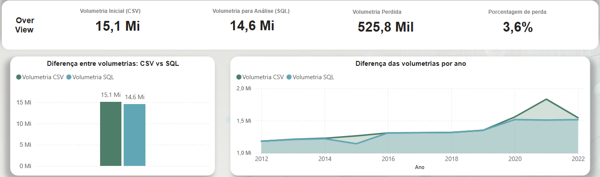

# Instruções de Execução do ETL

Este documento explica como executar os scripts `extract.sh` e `extract2.sh` no diretório `etl/`, detalhando o fluxo ETL conforme o diagrama `etl-activity-diagram.png`.

## Visão Geral

A etapa do ETL deste projeto foi totalmente automatizada utilizando um script desenvolvido em Shell Script e um utilitário em Linguagem C. O processo realiza:
- **Download automático** dos arquivos de dados de mortalidade do SIM/DATASUS (anos 2012 a 2022).
- **Conversão de codificação** dos arquivos CSV para UTF-8, garantindo a correta leitura de caracteres especiais e acentuação.
- **Transformação** dos arquivos `.csv` em arquivos `.sql`, permitindo a carga automatizada no banco de dados MySQL.
- **Carga** dos dados no banco de dados.
- **Validação** por meio da comparação de volumetria entre os arquivos originais e os dados carregados no banco, identificando possíveis perdas ou falhas na importação.

Além dos dados principais, o script foi adaptado para realizar a conversão de charset e o carregamento de arquivos auxiliares, como os dicionários de idade, nacionalidade e CID. Essas tabelas auxiliares, criadas no banco, são fundamentais para análise e filtragem dos dados, especialmente porque informações sensíveis são disponibilizadas de forma codificada, em conformidade com a LGPD.

A escolha por Shell Script e C se deu pela eficiência e agilidade na manipulação de grandes volumes de dados, apresentando desempenho superior a outras linguagens como Java e Python para essas tarefas.

> **Dica:** Consulte o diagrama `etl-activity-diagram.png` antes de iniciar para entender o fluxo completo.

## Pré-requisitos

- Ambiente Linux ou WSL com bash.
- Ferramentas: `wget`, `iconv`, `mysql` (cliente), `wc`.
- Permissão de execução para scripts (`chmod +x extract.sh extract2.sh`).
- Binário `csvtosql-bin` compilado em `etl/csvtosql/`.
- Banco de dados MySQL acessível.

## Antes da Execução dos Scripts
Configure as informações para conexão correta com o banco de dados no início do script `extract.sh`:

```bash
# Definir variáveis para conexão com o banco
DB_HOST="localhost"
DB_USER="root"
DB_PASS="MyAmazingPa$$word"
DB_NAME="sim_data"
```

Certifique-se de ajustar essas variáveis conforme o ambiente e as credenciais do seu banco de dados MySQL.

## Estrutura de Diretórios

- `etl/` — scripts, utilitários e arquivos CSV originais.
- `etl/utf8/` — arquivos CSV convertidos para UTF-8 (criado automaticamente).
- `etl/sql/` — arquivos SQL gerados (criado automaticamente).
- `etl/csvtosql/` — utilitário de conversão CSV→SQL.

## Execução do Script Principal (`extract.sh`)

### 1. Download Automático dos Dados
O script baixa automaticamente os arquivos CSV de mortalidade dos anos 2012 a 2022 para o diretório `etl/`. Não é necessário baixar manualmente.

### 2. Normalização de Encoding
Os arquivos baixados são convertidos para UTF-8 e salvos em `etl/utf8/`.

### 3. Transformação
Cada arquivo UTF-8 é convertido em um arquivo SQL correspondente em `etl/sql/` usando o utilitário `csvtosql-bin`.

### 4. Carga no Banco de Dados
Os arquivos SQL são carregados automaticamente no banco MySQL configurado no script.

### 5. Validação
O script compara a quantidade de linhas dos arquivos CSV, SQL e das tabelas no banco, exibindo os resultados para conferência.

### Comando de Execução
```bash
cd etl
chmod +x extract.sh
./extract.sh
```

## Execução do Script Secundário (`extract2.sh`)

Após a execução do `extract.sh`, o `extract2.sh` deve ser executado para completar o processo ETL, incluindo tabelas de referência como `Idade`, `Nacionalidade` e `Ocupacao`.

### 1. Verifique os Arquivos Necessários
Assegure-se de que os seguintes arquivos estejam presentes em `etl/`:
- `Idade.csv`
- `Nacionalidade.csv`
- `Ocupacao.csv`
- `CID10.sql`

### 2. Execução do Script
Torne o script executável e execute-o:
```bash
chmod +x extract2.sh
./extract2.sh
```

## Expected Volumetry (Perda Esperada de Dados)

Durante o processo ETL, é esperado que haja uma pequena perda de registros devido a inconsistências, erros de formatação ou dados inválidos nos arquivos originais. A volumetria inicial dos arquivos CSV era de **15,1 milhões** de registros. Após as etapas de extração, transformação e carga, a volumetria final carregada no ambiente SQL para análise foi de **14,6 milhões** de registros. Essa diferença representa uma perda controlada de **525,8 mil registros**, equivalente a apenas **3,6%** do total inicial. Essa perda é considerada aceitável e esperada em processos de ETL de grande escala, sendo monitorada e documentada para garantir a integridade e a qualidade dos dados analisados.



## Observações Finais

- É crucial que a ordem de execução seja mantida: primeiro `extract.sh`, depois `extract2.sh`.
- A validação final deve ser conferida para garantir que todos os dados foram carregados corretamente.
- Para qualquer erro durante a execução, revise as mensagens do terminal e consulte a documentação para resolução de problemas.
- Consulte sempre o diagrama de atividades para entender o fluxo.
- Para dúvidas sobre os dados, veja a pasta `etl/data-information/`.

---

**Resumo Completo:**
1. Verifique os arquivos de entrada em `etl/` (veja lista acima).
2. Torne os scripts executáveis.
3. Execute `extract.sh` e, em seguida, `extract2.sh`.
4. Os arquivos SQL gerados estarão em `etl/sql/` e serão carregados automaticamente no banco de dados.

Para mais detalhes, consulte a documentação e o diagrama de atividades.
